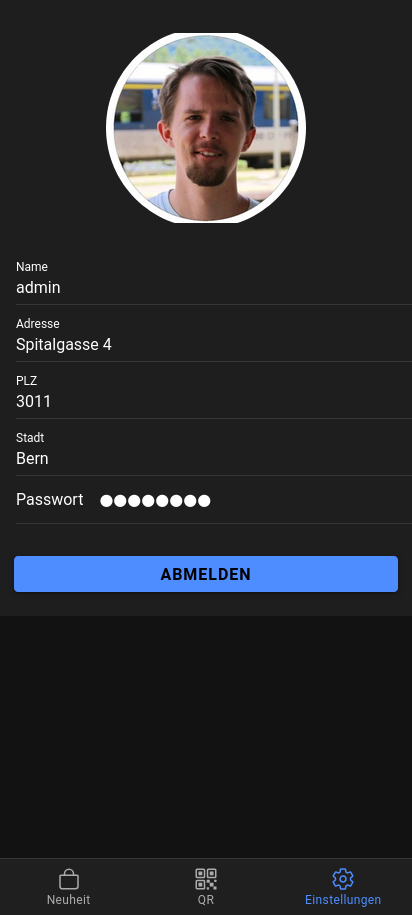

<!-- _class: centered -->

# Entwicklung einer Kunden-App für Handelsunternehmen mit Odoo als Backend

**Elias Kupeczki**

---

# Inhaltsverzeichnis
  
- **Überblick**
- **Zeitplan**
- **Projektmethode**
- **Umsetzung**
- **Resultat**
- **Reflexion**

---

# Überblick

## IST Situation
- **Aktuelle Systemübersicht**

## SOLL Situation
- **Anforderungen**

---

## IST Situation
- Handelsunternehmen nutzt Odoo als ERP-System
- Keine native App und Website
- Produktinformationen nur auf der Website verfügbar

---

## SOLL Situation
- Entwicklung einer mobilen Kunden-App basierend auf Ionic & Angular
- Direkte Anbindung an Odoo für Echtzeit-Daten
- Anzeige von Produkten mit „Neuheit“-Markierung
- Verwaltung des Kundenkontos (Adresse, Telefonnummer, Passwort)
- QR-Code zur Identifikation an der Kasse
- Offline-Nutzung für QR-Code und Punktestand

---

# Zeitplan

---

# Projektmethode

## Kanban
- **Backlog**: Sammlung aller Features und Aufgaben
- **To-Do**: Geplante Aufgaben für die nächste Iteration
- **In Progress**: Aktuell bearbeitete Aufgaben
- **Testing**: Qualitätssicherung der implementierten Funktionen
- **Done**: Abgeschlossene Aufgaben

---

# Umsetzung
- **Tools** 
- **MVC-Architektur** 
- **Systemmodellierung** 

---

# Tools
- **Ionic mit Capacitor** für plattformübergreifende Entwicklung
- **Angular** als Frontend-Framework
- **JSON-RPC** zur Backend-Anbindung
- **Selenium** für End-to-End-Tests

---

# MVC-Architektur
- **Model**: Repräsentation von Produkten, Bestellungen und Benutzern
- **View**: Benutzeroberfläche der App mit modernen UI-Komponenten
- **Controller**: Verarbeitung der API-Anfragen und Geschäftslogik

---

# Systemmodellierung

---

## App-Übersicht
- **Dashboard**: Anzeige des Treuepunkte-QR-Codes
- **Produktseite**: Aktuelle Produktangebote mit „Neuheit“-Markierung
- **Profilseite**: Verwaltung persönlicher Kundendaten
- **Offline-Modus**: Anzeige von QR-Code und Punktestand ohne Internet

---

<!-- _class: split -->

## Dashboard

---

<!-- _class: split -->

## Produktseite

---

<!-- _class: split -->

## Profilseite

---

# Resultate

## Test und Testkonzept
- **Unit Tests** zur Prüfung einzelner Komponenten
- **Integrationstests** zur Sicherstellung der API-Kommunikation
- **Usability-Tests** mit echten Nutzern zur Optimierung der Bedienbarkeit
- **Automatisierte End-to-End-Tests** mit Selenium

---

# Reflexion

## Herausforderungen und Lösungen
- **Performance-Probleme** → Caching-Strategien implementiert
- **Offline-Funktionalität** → Speicherung von Kerninformationen für den Offline-Modus
- **Testautomatisierung** → Einführung von Selenium für automatisierte End-to-End-Tests

---

## Zentrale Lerninhalte
- Praktische Anwendung von **Ionic und Angular**
- **Effiziente API-Integration** mit Odoo (JSON-RPC)
- **Automatisierte Tests** mit Selenium und Mocha
- **Agiles Arbeiten mit Kanban** und iterativer Entwicklung

---

## Zukünftige Erweiterungen
- **Push-Benachrichtigungen** für Angebote und Punktestände
- **Erweiterte Such- und Filterfunktionen** für Produkte
- **Mehrsprachige Unterstützung** für eine größere Zielgruppe
- **Integration von weiteren Treueprogrammen** in die App
